# AUTOMATE INFRASTRUCTURE WITH IAC USING TERRAFORM PART 1

In this project we would build the AWS infrastructure for 2 websites that was built manually in project 15 by automating the process with IaC using Terraform.

1. Create an IAM user, name it terraform (ensure that the user has only programatic access to your AWS account) and grant this user ***AdministratorAccess*** permissions, then copy the secret access key and access key ID. Save them locally temporarily.


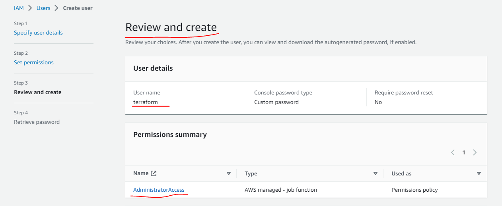

2. Configure programmatic access from my workstation to connect to AWS using the access keys copied above and a Python SDK (boto3) ensuring the use of Python 3.6 or higher from my workstation.


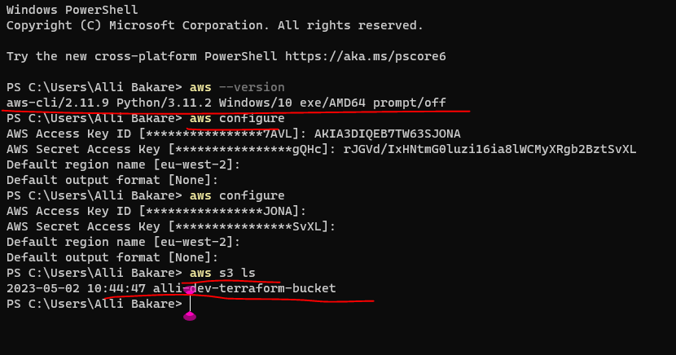

3. Create an S3 bucket to store Terraform state file. You can naming it <yourname>-dev-terraform-bucket (Note: S3 bucket names must be unique unique within a region partition, you can read about S3 bucken naming in this article). We will use this bucket from Project-17 onwards.


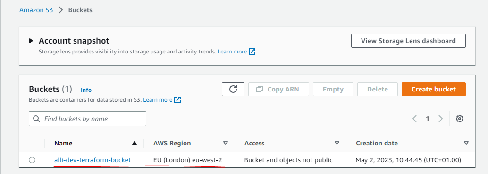


* When you have configured authentication and [installed boto3](https://boto3.amazonaws.com/v1/documentation/api/latest/guide/quickstart.html#installation), make sure you can programmatically access your AWS account by running following commands in >python:

```
import boto3
s3 = boto3.resource('s3')
for bucket in s3.buckets.all():
    print(bucket.name)
```

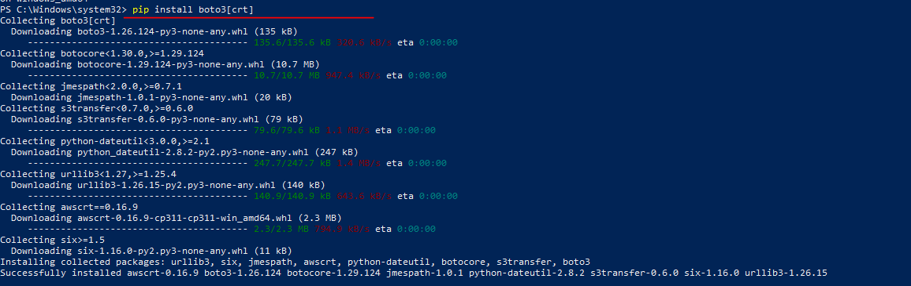

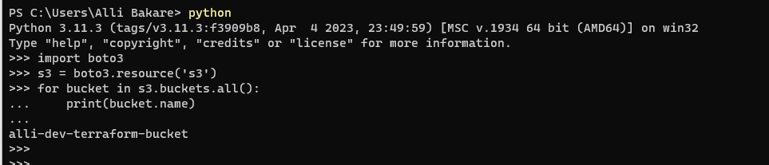


4. Install ***Terraform*** and verify it installed


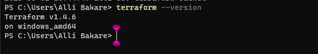


## VPC | Subnets | Security Groups

* Start by creating a directory structure


Open your VSCode and:

* Create a folder called PBL
* Create a file in the folder, name it ***main.tf***
* Ensure installing necessary Terraform extensions

Your setup should look like this.


### Provider and VPC resource section


Set up Terraform CLI as per this instruction.


* Add AWS as a provider, and a resource to create a VPC in the main.tf file.
* Provider block informs Terraform that we intend to build infrastructure within AWS.
* Resource block will create a VPC.


```
provider "aws" {
  region = "eu-west-2"
}

# Create VPC
resource "aws_vpc" "main" {
  cidr_block                     = "172.16.0.0/16"
  enable_dns_support             = "true"
  enable_dns_hostnames           = "true"
  enable_classiclink             = "false"
  enable_classiclink_dns_support = "false"
}
```

***Note***: You can change the configuration above to create your VPC in other region that is closer to you. The same applies to all configuration snippets that will follow.

* The next thing we need to do, is to download necessary ***plugins*** for Terraform to work. These plugins are used by providers and provisioners. At this stage, we only have provider in our `main.tf` file. So, Terraform will just download plugin for AWS provider.

* Lets accomplish this with `terraform init` command as seen in the below demonstration.


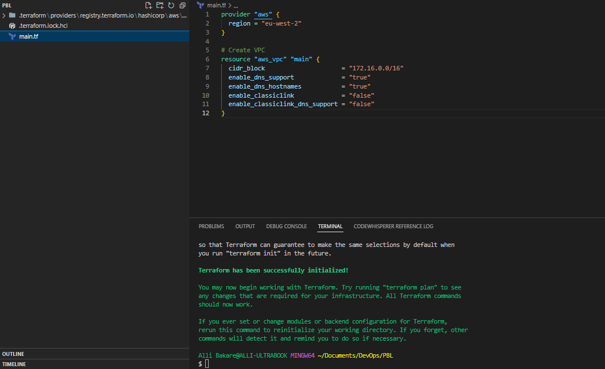

* Run `terraform plan`
* Then, if you are happy with changes planned, execute `terraform apply`

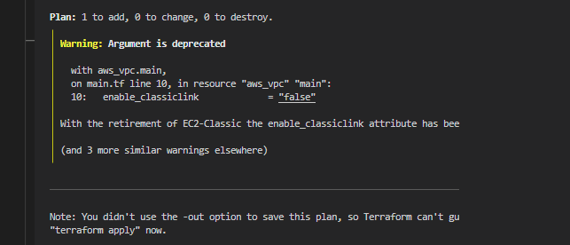


** I updated the plan by commenting out the *enable_classiclink* due to the result above:


### Subnets resource section

According to our architectural design, we require 6 subnets:

* 2 public
* 2 private for webservers
* 2 private for data layer

So, I would create the first 2 public subnets by adding the below configuration to the `main.tf` file:

```
# Create public subnets1
    resource "aws_subnet" "public1" {
    vpc_id                     = aws_vpc.main.id
    cidr_block                 = "172.16.0.0/24"
    map_public_ip_on_launch    = true
    availability_zone          = "eu-west-2a"

}

# Create public subnet2
    resource "aws_subnet" "public2" {
    vpc_id                     = aws_vpc.main.id
    cidr_block                 = "172.16.1.0/24"
    map_public_ip_on_launch    = true
    availability_zone          = "eu-west-2b"
}
```

* We are creating ***2 subnets***, therefore declaring ***2 resource blocks*** – one for each of the subnets.
* We are using the ***vpc_id*** argument to interpolate the value of the VPC id by setting it to ***aws_vpc.main.id***. This way, Terraform knows inside which VPC to create the subnet.

Run `terraform plan` and `terraform apply`


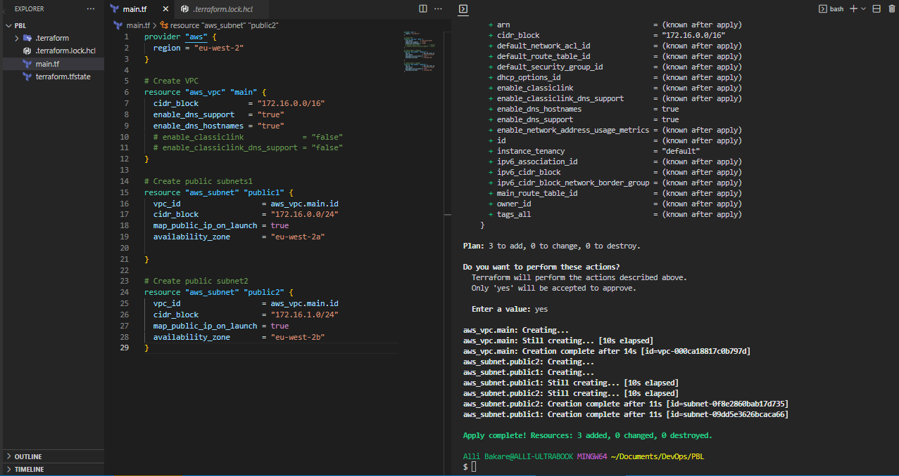


### Observations:

**We hard coded values**: Remember our best practice hint from the beginning? Both the availability_zone and cidr_block arguments are hard coded. We should always endeavour to make our work dynamic. Multiple Resource Blocks: Notice that we have declared multiple resource blocks for each subnet in the code. This is bad coding practice. We need to create a single resource block that can dynamically create resources without specifying multiple blocks. Now let us improve our code by refactoring it.

Now, **destroy** the current infrastructure. Since we are still in development, this is totally fine. Otherwise, **DO NOT DESTROY** an infrastructure that has been deployed to production.

To destroy whatever has been created run `terraform destroy` command, and type ***yes*** after evaluating the plan.


## Fixing The Problems By Code Refactoring

***Fixing Hard Coded Values***: We will introduce variables, and remove hard coding.

* Starting with the provider block, declare a variable named `region`, give it a `default` value, and update the `provider` section by referring to the declared variable. Then, do the same to `cidr` value in the `vpc` block, and all the other arguments.

```
  variable "region" {
        default = "eu-west-2"
    }

    variable "vpc_cidr" {
        default = "172.16.0.0/16"
    }

    variable "enable_dns_support" {
        default = "true"
    }

    variable "enable_dns_hostnames" {
        default ="true" 
    }

    variable "enable_classiclink" {
        default = "false"
    }

    variable "enable_classiclink_dns_support" {
        default = "false"
    }

    provider "aws" {
    region = var.region
    }

    # Create VPC
    resource "aws_vpc" "main" {
    cidr_block                     = var.vpc_cidr
    enable_dns_support             = var.enable_dns_support 
    enable_dns_hostnames           = var.enable_dns_support
    enable_classiclink             = var.enable_classiclink
    enable_classiclink_dns_support = var.enable_classiclink

    }
```

We are just going to introduce some interesting concepts. `Loops & Data sources`

Terraform has a functionality that allows us to pull data which exposes information to us. Let us fetch Availability zones from AWS, and replace the hard coded value in the subnet’s `availability_zone` section.

```
# Get list of availability zones
        data "aws_availability_zones" "available" {
        state = "available"
        }
```

To make use of this new data resource, we will need to introduce a `count` argument in the subnet block: Something like this.

```
# Create public subnet1
resource "aws_subnet" "public" { 
    count                   = 2
    vpc_id                  = aws_vpc.main.id
    cidr_block              = "172.16.1.0/24"
    map_public_ip_on_launch = true
    availability_zone       = data.aws_availability_zones.available.names[count.index]

}
```

But we still have a ***problem***. If we run `Terraform` with this configuration, it may succeed for the first time, but by the time it goes into the second loop, it will fail because we still have `cidr_block` hard coded. The same `cidr_block` cannot be created twice within the same VPC. So, we have a little more work to do.


We will introduce a function `cidrsubnet()` to make this happen. It accepts 3 parameters.


```
 # Create public subnet1
  resource "aws_subnet" "public" { 
      count                   = 2
      vpc_id                  = aws_vpc.main.id
      cidr_block              = cidrsubnet(var.vpc_cidr, 4 , count.index)
      map_public_ip_on_launch = true
      availability_zone       = data.aws_availability_zones.available.names[count.index]

  }
```

We can introuduce `length()` function, which basically determines the length of a given ***`list`, `map`, or `string`***.

Since `data.aws_availability_zones.available.names` returns a list like ***["eu-west-2a", "eu-west-2b", "eu-west-2c"]*** we can pass it into a `lenght` function and get number of the AZs.

Now we can simply update the public subnet block like this:

```
# Create public subnet1
    resource "aws_subnet" "public" { 
        count                   = length(data.aws_availability_zones.available.names)
        vpc_id                  = aws_vpc.main.id
        cidr_block              = cidrsubnet(var.vpc_cidr, 4 , count.index)
        map_public_ip_on_launch = true
        availability_zone       = data.aws_availability_zones.available.names[count.index]

    }
```

***Observations***:

What we have now, is sufficient to create the subnet resource required. But if you observe, it is not satisfying our business requirement of just 2 subnets. The length function will return number 3 to the `count` argument, but what we actually need is 2.

***Now, let us fix this.***


Declare a `variable` to store the desired number of public subnets, and set the default value:

```
variable "preferred_number_of_public_subnets" {
  default = 2
}
```

Next, update the `count` argument with a condition. `Terraform` needs to check first if there is a desired number of subnets. Otherwise, use the data returned by the `lenght` function. See how that is presented below.

```
# Create public subnets
resource "aws_subnet" "public" {
  count  = var.preferred_number_of_public_subnets == null ? length(data.aws_availability_zones.available.names) : var.preferred_number_of_public_subnets   
  vpc_id = aws_vpc.main.id
  cidr_block              = cidrsubnet(var.vpc_cidr, 4 , count.index)
  map_public_ip_on_launch = true
  availability_zone       = data.aws_availability_zones.available.names[count.index]

}
```

Now lets break it down:

* The first part `var.preferred_number_of_public_subnets == null` checks if the value of the `variable` is set to `null` or has some value defined.
* The second part `?` and `length(data.aws_availability_zones.available.names)` means, if the first part is `true`, then use this. In other words, if preferred number of public subnets is null (Or not known) then set the value to the data returned by lenght function.
* The third part `:` and `var.preferred_number_of_public_subnets` means, if the first condition is `false`, i.e ***preferred number of public subnets*** is not `null` then set the value to whatever is definied in `var.preferred_number_of_public_subnets`


Now the entire configuration should now look like this:

```
# Get list of availability zones
data "aws_availability_zones" "available" {
state = "available"
}

variable "region" {
      default = "eu-west-2"
}

variable "vpc_cidr" {
    default = "172.16.0.0/16"
}

variable "enable_dns_support" {
    default = "true"
}

variable "enable_dns_hostnames" {
    default ="true" 
}

variable "enable_classiclink" {
    default = "false"
}

variable "enable_classiclink_dns_support" {
    default = "false"
}

  variable "preferred_number_of_public_subnets" {
      default = 2
}

provider "aws" {
  region = var.region
}

# Create VPC
resource "aws_vpc" "main" {
  cidr_block                     = var.vpc_cidr
  enable_dns_support             = var.enable_dns_support 
  enable_dns_hostnames           = var.enable_dns_support
  enable_classiclink             = var.enable_classiclink
  enable_classiclink_dns_support = var.enable_classiclink

}

# Create public subnets
resource "aws_subnet" "public" {
  count  = var.preferred_number_of_public_subnets == null ? length(data.aws_availability_zones.available.names) : var.preferred_number_of_public_subnets   
  vpc_id = aws_vpc.main.id
  cidr_block              = cidrsubnet(var.vpc_cidr, 4 , count.index)
  map_public_ip_on_launch = true
  availability_zone       = data.aws_availability_zones.available.names[count.index]

}
```

***Note***: You should try changing the value of `preferred_number_of_public_subnets` variable to `null` and notice how many subnets get created.


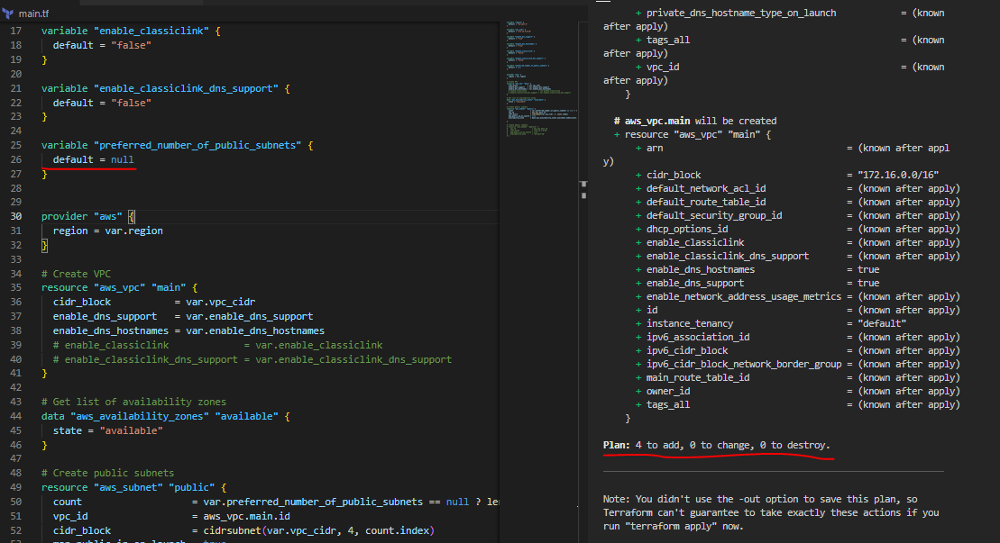


## Introducing variables.tf & terraform.tfvars

Instead of havng a long list of variables in `main.tf` file, we can actually make our code a lot more readable and better structured by moving out some parts of the configuration content to other files.

* We will put all ***variable*** declarations in a separate file
* And provide non default values to each of them

1. Create a new file and name it `variables.tf`
2. Copy all the variable declarations into the new file.
3. Create another file, name it `terraform.tfvars`
4. Set values for each of the variables.

And the end, I had the following configs in each of the defined files:

***Maint.tf***

```
# Get list of availability zones
data "aws_availability_zones" "available" {
state = "available"
}

provider "aws" {
  region = var.region
}

# Create VPC
resource "aws_vpc" "main" {
  cidr_block                     = var.vpc_cidr
  enable_dns_support             = var.enable_dns_support 
  enable_dns_hostnames           = var.enable_dns_support
  enable_classiclink             = var.enable_classiclink
  enable_classiclink_dns_support = var.enable_classiclink

}

# Create public subnets
resource "aws_subnet" "public" {
  count  = var.preferred_number_of_public_subnets == null ? length(data.aws_availability_zones.available.names) : var.preferred_number_of_public_subnets   
  vpc_id = aws_vpc.main.id
  cidr_block              = cidrsubnet(var.vpc_cidr, 4 , count.index)
  map_public_ip_on_launch = true
  availability_zone       = data.aws_availability_zones.available.names[count.index]
}
```


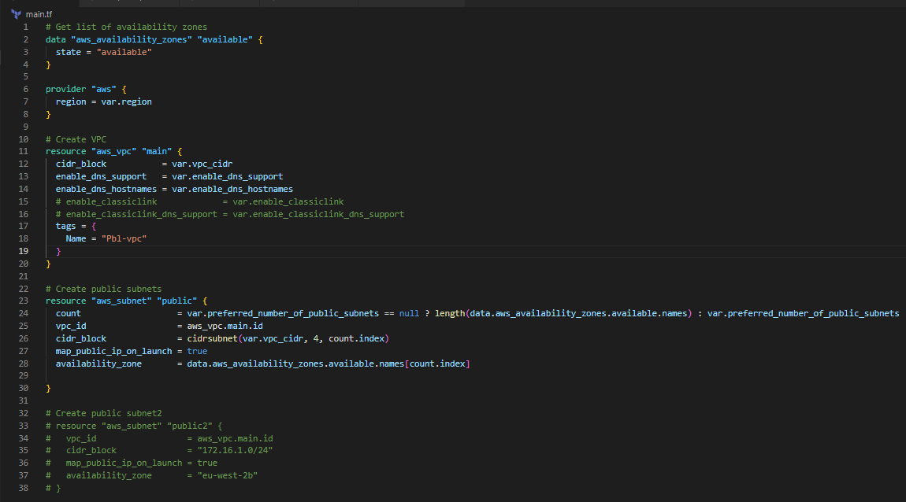

***variables.tf***

```
variable "region" {
      default = "eu-central-1"
}

variable "vpc_cidr" {
    default = "172.16.0.0/16"
}

variable "enable_dns_support" {
    default = "true"
}

variable "enable_dns_hostnames" {
    default ="true" 
}

variable "enable_classiclink" {
    default = "false"
}

variable "enable_classiclink_dns_support" {
    default = "false"
}

  variable "preferred_number_of_public_subnets" {
      default = null
}
```

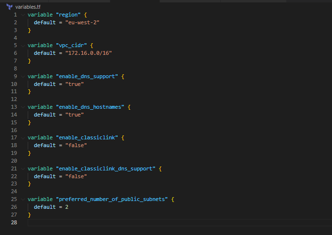


***terraform.tfvars***
```
region = "eu-central-1"

vpc_cidr = "172.16.0.0/16" 

enable_dns_support = "true" 

enable_dns_hostnames = "true"  

enable_classiclink = "false" 

enable_classiclink_dns_support = "false" 

preferred_number_of_public_subnets = 2
```


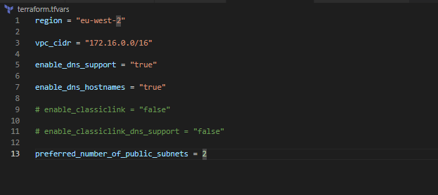

At this point, we should have this file structure in the PBL folder as:

```
└── PBL
    ├── main.tf
    ├── terraform.tfstate
    ├── terraform.tfstate.backup
    ├── terraform.tfvars
    └── variables.tf
```


Run the following commands to ensure everything works

`terraform fmt`

`terraform plan`

`terraform apply --auto-approve`


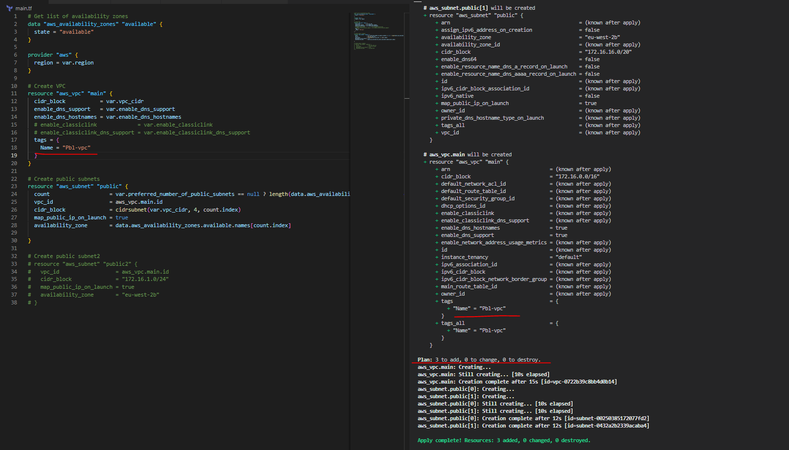


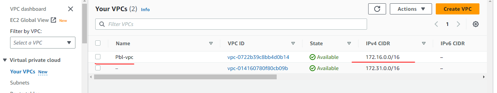


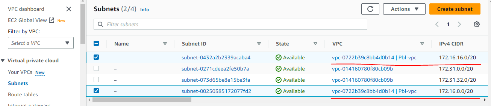


***END OF PROJECT...***